# noisy

TODO

## Usage

### Paint Noise

``` clojure
(require '[noisy.core :refer :all])
(paint2d (murmur-noise) 200 200)
```

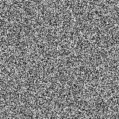

``` clojure
(require '[noisy.core :as c])
(paint1d (murmur-noise) 400 100)
```

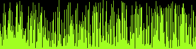

### Scale Noise


```clojure
(paint2d (-> (murmur-noise)
             (floor)
             (scale 10)) 200 200)
```

... Minecraft anyone?

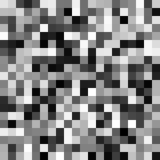

```clojure
(paint1d (-> (murmur-noise)
             (floor)
             (scale 10)) 400 100)
```


### Perlin Noise

#### Generic example

My perlin implementation that uses a murmur based gradient-generator
which is currently much slower than the classical perlin implementation:

```clojure
(paint2d (-> (perlin)
             (scale 10)) 200 200)
```

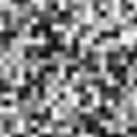

For the classical, improved perlin noise:


```clojure
(paint2d (-> (perlin-improved)
             (scale 10)) 200 200)
```

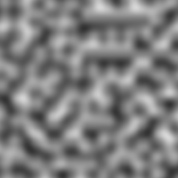

```clojure
(paint1d (-> (perlin)
             (scale 40)) 400 100)
```


#### Close-up

```clojure
(paint2d (-> (perlin)
             (scale 50)) 200 200)
```


#### Linear Interpolation (Yikes!)

```clojure
(paint2d (-> (perlin :curve-fn linear-interpolation)
             (scale 10)) 200 200)
```


## Modifiers

### Gradients

```clojure
(paint2d (-> (perlin :seed 1)
             (scale 20)
             (c/modify (c/gradient Color/BLACK -0.7
                                   c/rgba-interpolation Color/RED 0
                                   c/rgba-interpolation Color/YELLOW 0.7)))
         200 200)
```
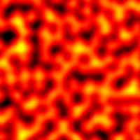

### Absolute Value

```clojure
(paint2d (-> (perlin :seed 1)
             (scale 20)
             c/abs)
         200 200)
```
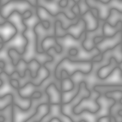

### Normalisation

```clojure
(paint2d (-> (perlin :seed 1)
             (scale 20)
             c/abs
             (c/normalize-modifier 0 1))
         200 200)
```
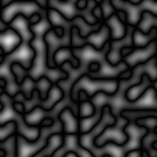

### Invert

```clojure
(paint2d (-> (perlin :seed 1)
             (scale 20)
             c/abs
             (c/normalize-modifier 0 1)
             c/invert)
         200 200)
```
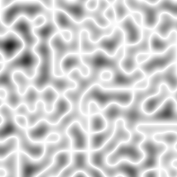

### Modifier Examples

```clojure
(paint2d (-> (perlin :seed 1)
             (scale 20)
             (c/normalize-modifier -1 1 0 1)
             (c/modify #(* % %))
             (c/normalize-modifier 0 1))
         200 200)
```
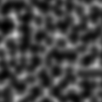

```clojure
(paint2d (-> (perlin :seed 1)
             (scale 40)
             (c/modify #(mod % 0.1))
             (c/normalize-modifier 0 0.1))
         200 200)
```
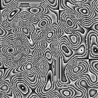

```clojure
(paint2d (-> (perlin :seed 1)
             (scale 40)
             (c/modify #(mod % 0.33))
             (c/normalize-modifier 0 0.33)
             (c/invert))
         200 200)
```


```clojure
(paint2d (-> (perlin :seed 1)
             (scale 40)
             (c/normalize-modifier -1 1 -5 5)
             (c/modify math/floor)
             (c/normalize-modifier -5 5))
         200 200)
```
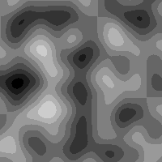

Pixelate for that special retro look:

```clojure
(paint2d (-> (perlin :seed 1)
             (c/offset 0.5 0.5 0.5)
             (scale 2)
             (floor)
             (scale 10))
         200 200)
```
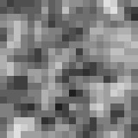

Fun with sinus:

```clojure
(paint2d (-> (perlin :seed 1)
             (scale 40)
             (c/modify #(Math/sin (* % 100))))
         200 200)
```
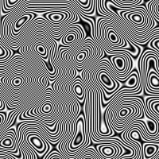

```clojure
(paint2d (-> (perlin :seed 1)
             (scale 80)
             (c/modify #(Math/sin (* % 300))))
         200 200)
```
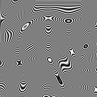

```clojure
(paint2d (-> (perlin :seed 1)
             (scale 40)
             (c/modify #(Math/sin (* % 700))))
         200 200)
```
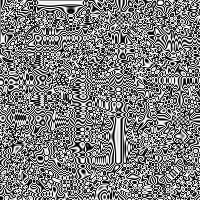

```clojure
(paint2d (-> (perlin :seed 1)
             (scale 40)
             ((fn [s]
                 (fn [& coords]
                     (apply s
                            (+ (first coords)
                                 (Math/sin (* 0.3 (second coords))))
                            (+ (second coords)
                                 (Math/sin (* 0.3 (first coords))))
                            (drop 2 coords))))))
               200 200)
```


## Utilities

### Grid & File export

```clojure
(paint2d (-> (perlin)
             (scale 40)) 200 200 :grid 40 :file "grid2d.png")
```

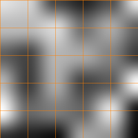

```clojure
(paint1d (-> (perlin)
             (scale 40)) 400 100 :grid 40 :file "grid1d.png")
```

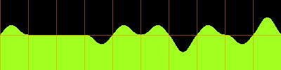

## TODOs
 - Add caching middleware
 - Add tiling
 - Add offset
 - Add paint3d:
   - export depth many images
   - export to animated GIF(?)

## License

TODO

Copyright © 2014 Roman Flammer
